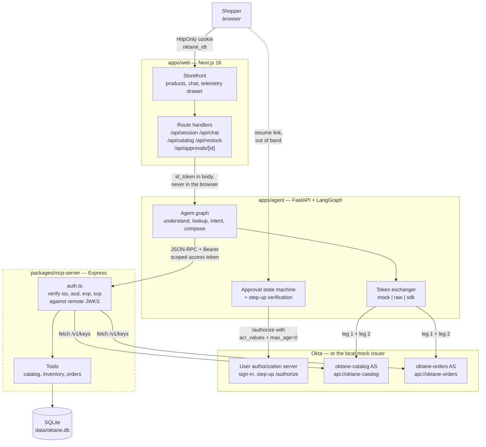
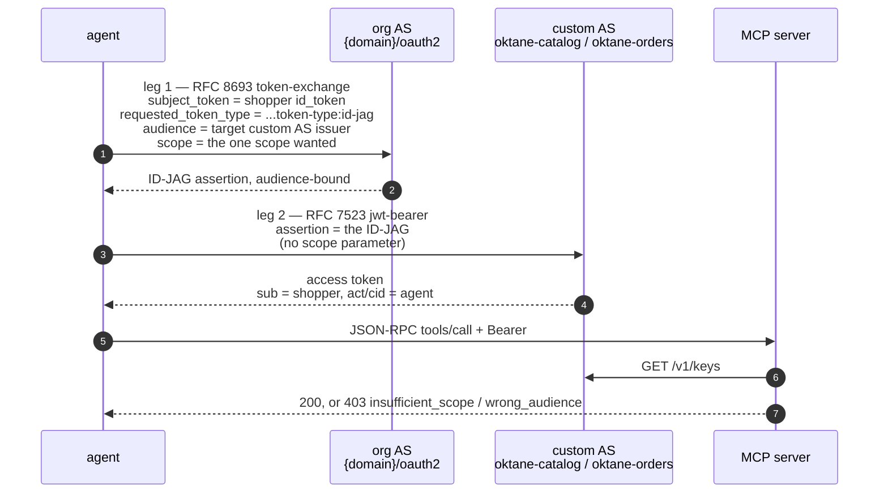
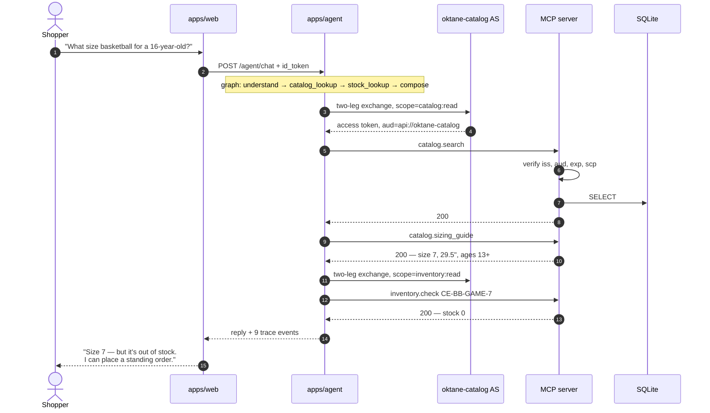
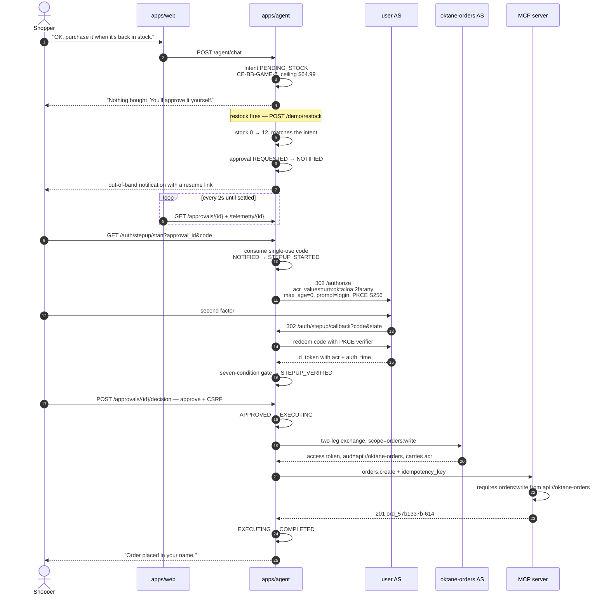
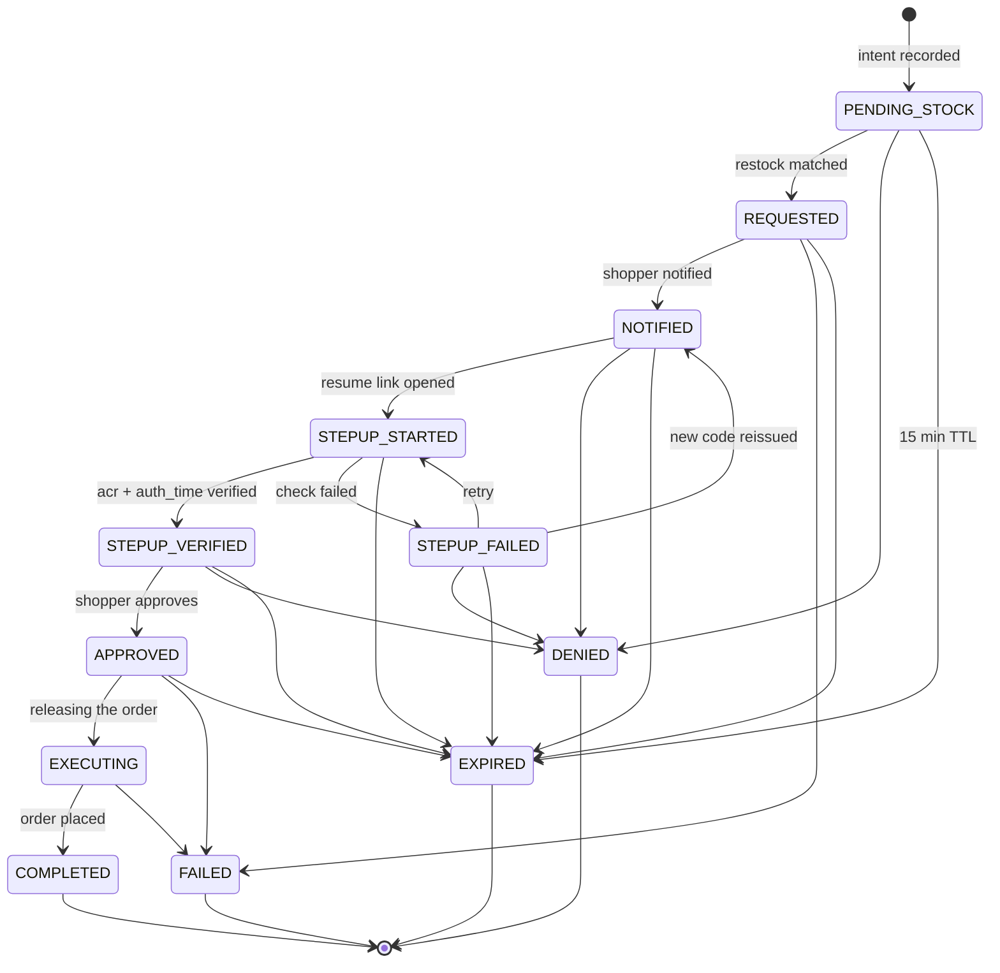
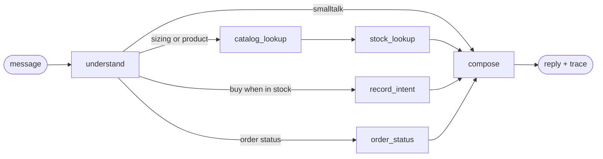
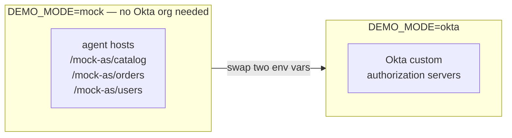

# Oktane B2C — Architecture

CourtEdge is a retail storefront with an AI shopping assistant. The assistant can
recommend a product and, later, **spend the shopper's money** — which is the
whole point: every capability it has is a short-lived, scope-limited token issued
on the shopper's behalf, and the money-spending one cannot be issued at all until
the shopper proves it is really them with a second factor.

This document describes what the code does today. Diagrams are Mermaid, so they
render in GitHub and in most IDE previews.

---

## 1. Components

Three services. The one thing worth internalising: **the agent never reaches the
database.** It must present a token to the MCP server, which verifies that token
against the issuer's JWKS and decides for itself whether the call is allowed.



The dashed boundary is the trust boundary. Turning `MCP_REQUIRE_AUTH` off and
watching a call succeed — then on, and watching it fail — is the demo's most
convincing thirty seconds.

### Where the shopper's token lives

The browser never holds a token. `POST /api/session` sets two cookies:

| Cookie | Flags | Contents |
|---|---|---|
| `oktane_idt` | `HttpOnly` | the shopper's ID token |
| `oktane_profile` | readable | name, email, `sub` — for rendering the header only |

Only `apps/web/lib/agent.ts` reads `oktane_idt`, server-side, and forwards it to
the agent. A compromised page script cannot exfiltrate the token.

---

## 2. Authorization model

Two custom authorization servers, not one. Separate issuers give genuine audience
isolation: a catalog token is not merely under-scoped for ordering, it is signed
by a key the orders resource server does not even consult.

| Authorization server | Audience | Scopes | Tools it unlocks |
|---|---|---|---|
| `oktane-catalog` | `api://oktane-catalog` | `catalog:read` | `catalog.search`, `catalog.sizing_guide` |
| | | `inventory:read` | `inventory.check` |
| `oktane-orders` | `api://oktane-orders` | `orders:read` | `orders.list` |
| | | `orders:write` | `orders.create` |

Source of truth: `packages/mcp-server/src/scopes.ts`.

### The two-leg exchange (ID-JAG / Cross App Access)

Each token the agent uses is produced by two RFC-standard hops, and **the two legs
go to two different authorization servers**. That is the part most easily got
wrong: leg 1 does not go to the resource's own authorization server.



Only the **org** authorization server can assert "this agent may act for this
user against that resource", so leg 1 is addressed to it and names the target
custom AS in `audience`. Leg 2 then goes to the custom AS named in the assertion,
and carries **no `scope` parameter** — the scope was fixed at leg 1 and rides
inside the assertion. Asking for scope again at leg 2 is how you get a confusing
`invalid_scope`.

Client authentication on both legs is `private_key_jwt` (RS256, 60-second
assertions). There is no client secret — the agent's private JWK never leaves
`apps/agent/.env`, and only its public half is registered with Okta. The agent's
workload principal id *is* its OIDC client id. Each assertion's `aud` is the
exact token endpoint URL, so one captured en route to the org server is worthless
against a custom one; `/demo/exchange-probe` provokes exactly that failure.

> **Status.** Both `mock` (in-process) and `raw` (real HTTP, real
> `private_key_jwt`) exchangers exist. `DEMO_MODE` and `TOKEN_EXCHANGE_IMPL` are
> orthogonal: the first picks *which issuer*, the second picks *how* the exchange
> is performed. `DEMO_MODE=mock` + `TOKEN_EXCHANGE_IMPL=raw` is a supported
> pairing that runs the full wire protocol against the local authorization
> servers, so pointing at a real org is a URL swap. `sdk_flow.py` is not written
> yet — see §10.

**`sub` versus `act`/`cid` is the entire "on behalf of" story.** The access token
carries the *shopper* as its subject and the *agent* as the actor. The order that
gets placed is the shopper's order; the audit trail says an agent placed it.

Tokens are cached per `(sub, audience, scope)`, which is why a repeat run of the
demo shows `Access token reused` instead of a fresh exchange.

---

## 3. Read path — demo beats 1 to 4

The shopper asks a sizing question. Answering it requires real catalog and
inventory data, so the assistant has to obtain a token and make MCP calls. It
gets read scopes and nothing else.



The recommendation is **grounded**, not asserted by a prompt: the sizing rule
comes out of the database through `catalog.sizing_guide`, and the out-of-stock
fact through `inventory.check`. No `orders:*` scope was requested, so at this
point the agent is structurally incapable of buying anything.

---

## 4. Human-in-the-loop path — demo beats 5 to 8

The shopper says "purchase it when it's back in stock." A standing intent is
recorded. **No purchase happens, and no purchase can happen**, until a restock
raises an approval and the shopper clears a second factor.



Note the ordering: the `orders:write` token is requested **after** step-up
verification, never before. The agent does not hold a spending capability that it
then declines to use — it cannot obtain one until the human has acted.

### Why the resume link is not an authorization

The link carries an opaque `approval_id` and a single-use `code`. That is enough
to *name* an approval and nothing more. Releasing the order requires **all seven**
of these, each checked and reported by name in
`apps/agent/app/approvals/stepup.py`:

1. a completed `/authorize` round trip with **PKCE** — verifier held server-side, never in the URL
2. `state` bound server-side to this approval, usable exactly once
3. ID token `sub` **equals** the approval's subject — a forwarded link signed in as someone else fails
4. `nonce` matches
5. `acr` equals the required value, **failing closed when absent** — Okta silently ignores unrecognised `acr_values`, so a typo would otherwise look like success
6. `auth_time` is later than the approval **and** within the freshness window (120s) — this is what `max_age=0` buys, and it is why `acr` alone is not enough
7. the single-use resume code is marked consumed

Two further hardening choices: the decision is a **POST with CSRF**, because a GET
approve link is prefetchable by mail scanners; and `orders.create` takes an
**idempotency key**, so a double-click cannot place two orders.

---

## 5. Approval state machine

Every transition is a guarded update conditioned on the expected current state,
so concurrent requests cannot both win. Table: `apps/agent/app/approvals/store.py`.



A failed step-up is **retryable**, not a dead end: the original emailed link
stays strictly single-use, and a replacement code is handed only to the browser
that just failed. A shopper who fumbles a second factor is not locked out, and a
leaked link still cannot be replayed.

---

## 6. Agent reasoning graph

LangGraph, in `apps/agent/app/agent/graph.py`. Small on purpose — the interesting
part of this demo is the authorization, not the planner.



Every node that needs data calls the MCP server, and every such call needs a
token. `compose` phrases the reply — with Claude when `ANTHROPIC_API_KEY` is set,
otherwise from a deterministic script so the demo narrative is reproducible.

---

## 7. Mock mode

`DEMO_MODE=mock` is not a stub. The agent runs a local authorization server that
generates a real RSA keypair, mints real RS256 JWTs, and serves a real JWKS that
the MCP server fetches and verifies against. Every signature check, audience
check, and scope check in the diagrams above executes for real. Only the issuer
is local.



What changes when you point at a real org: `DEMO_MODE`, `TOKEN_EXCHANGE_IMPL`,
`OKTA_CATALOG_ISSUER`, `OKTA_ORDERS_ISSUER`, and the agent's client id and private
JWK. No application logic changes — see `apps/agent/app/config.py`.

`scripts/dev.sh` runs the whole stack with `MCP_REQUIRE_AUTH=true` by default, so
the enforcing configuration is the one you get without asking.

---

## 8. Proving the enforcement is real

`POST /demo/scope-probe` deliberately attacks the MCP server with tokens the
agent should not be able to use, and reports which protection refused it:

| Attack | Token presented | Refusal |
|---|---|---|
| Wrong scope, right audience | genuine `orders:read` from `oktane-orders` | `insufficient_scope` — *"orders.create requires orders:write; token carries [orders:read]"* |
| Wrong audience entirely | genuine `inventory:read` from `oktane-catalog` | `wrong_audience` — *"token audience is api://oktane-catalog, this tool requires api://oktane-orders"* |

Neither refusal involves asking the agent nicely. The resource server decides.

Related negative results, all currently verified:

- replaying a consumed resume link → `invalid_resume_link — resume code already used`
- opening `/approve/{id}` without the step-up session → buttons withheld, *"This link on its own cannot approve a purchase."*
- absent `acr` → fails closed rather than defaulting to allow

---

## 9. Reading the telemetry drawer

The collapsible drawer on the right is the technical payoff. It shows an ordered
trace of every identity event, and each token chip expands to decoded claims with
the signature elided. A complete purchase looks like this:

```
stepup        Step-up verified          acr=urn:okta:loa:2fa:any auth_time=…
user_token    Shopper ID token          aud=oktane-b2c-storefront acr=… auth_time=…
id_jag        ID-JAG for oktane-orders  aud=<orders AS issuer>
access_token  Access token              aud=api://oktane-orders scp=[orders:write] acr=…
mcp_call      MCP orders.create 200     tool=orders.create
note          Order placed on the shopper's behalf
```

Above it sits a plain-language summary for the non-technical half of the room.
Tokens are never logged — only claim digests.

---

## 10. Implementation status

Everything in §1 through §9 is running code, verified in a browser, **with one
qualifier**: the issuer is currently the agent's own local authorization server
rather than an Okta org.

| Area | Status |
|---|---|
| Storefront, chat, telemetry drawer, approve page | done |
| MCP server in the request path, JWKS verification, per-tool scope | done, enforced by default |
| Two-leg exchange shape, `sub` / `act` / `cid` claims, token cache | done, mock issuer |
| Intents, approval state machine, guarded transitions, idempotency | done |
| Step-up: PKCE, `state` binding, `sub` binding, `nonce`, `acr`, `auth_time`, single-use code | done, mock issuer |
| Scope-probe negative tests | done, both refusals verified |
| `raw_flow.py` — the two-leg exchange over real HTTP with `private_key_jwt` | done, mock issuer |
| Exchange-probe negative tests against the token endpoints | done, all four refusals verified |
| Okta OIDC sign-in against a real org | not started |
| Terraform for users, groups, app, two authorization servers, claims | not started |
| `sdk_flow.py` — `okta-client-python` `CrossAppAccessFlow` adapter | not started |
| Real step-up against the org, JWKS verifier in `app/security/` | not started |
| Secures-AI agent registration | not started |

The remaining rows all need an Okta org domain, an admin API token, and the
agent's registered workload principal id. No application logic changes with them —
only configuration, per `apps/agent/app/config.py`.
